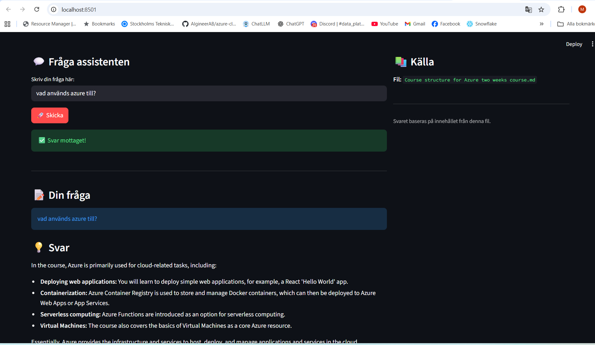

# RAG YouTuber Assistant

En intelligent assistent som svarar på frågor baserade på **transkriberade videoklipp från flera data engineering‑kurser** av en YouTuber.  
Projektet använder Retrieval‑Augmented Generation (RAG) för att ge korrekta och kontextuella svar genom att söka i transkriptionerna.  
Syftet är att förbättra inlärningsupplevelsen genom att låta användaren ställa frågor om kursinnehållet i ett enkelt gränssnitt.

---

## Höjdpunkter från labben

Detta projekt demonstrerar en komplett RAG‑kedja, från data till användargränssnitt:

- **Task 0 – Data & LanceDB**
  - Arbetar med transkriberade videoklipp från olika data‑engineeringrelaterade kurser.
  - Sätter upp en LanceDB‑vektordatabas som kunskapsbas.
  - Lagrar både rå text (`content`) och vektorembeddings i samma tabell (`Article`‑modellen).

- **Task 1 – RAG med PydanticAI**
  - Bygger ett Retrieval‑Augmented Generation (RAG)‑flöde med PydanticAI.
  - Hämtar relevanta textavsnitt från LanceDB och låter en LLM formulera svaret.
  - Målet är att efterlikna YouTuberns ton/personlighet i svaren.

- **Task 2 – API & Frontend**
  - **FastAPI‑backend** som exponerar ett `/rag/query`‑endpoint (samt t.ex. `/ping` för hälsokoll).
  - **Streamlit‑frontend** som låter användaren skriva frågor, se svar och se vilken kursfil svaret bygger på.

- **Vektor‑ och språkmodeller**
  - **LLM:** Google Gemini.
  - **Embeddings:** `models/text-embedding-004` via `gemini-text`‑registret i LanceDB.
  - **Vektordatabas:** LanceDB med `Article`‑modellen:

    ```python
    class Article(LanceModel):
        doc_id: str
        file_name: str
        content: str = embedding_model.SourceField()
        embedding: Vector(embedding_model.ndims()) = embedding_model.VectorField()
    ```

- **Svarsmodell**
  - API:t returnerar en `RagResponse` med:
    - `file_name` – vilken fil som låg till grund för svaret
    - `file_path` – logisk/absolut sökväg (eller `"N/A"`)
    - `answer` – det genererade svaret

---

## Kom igång lokalt

### Förutsättningar

- Python 3.10+
- [uv](https://github.com/astral-sh/uv) installerat
- Google API‑nyckel för Gemini

### 1. Klona projektet

```bash
git clone <din-repo-url-här>
cd <ditt-repo-namn> 
```

### 2. Skapa miljö och installera beroenden (med uv)

Projektet är uppsatt med `uv init` och `uv add`, så du kan använda `uv` genomgående.

#### 2.1 Om du startar ett helt nytt projekt med uv

Om du börjar från noll (ingen `pyproject.toml` än):

Skapa ett nytt projekt:
```bash
uv init
```

Lägg till dina beroenden, t.ex.:
```bash
uv add fastapi uvicorn[standard] streamlit lancedb pydantic google-generativeai python-dotenv
```

På macOS/Linux:

```bash
uv venv
source .venv/bin/activate
uv sync
```

På Windows:

```bash
uv venv
.venv\Scripts\activate
uv sync
```
### 3. Ställ in miljövariabler (Gemini-nyckel)

Skapa en fil som heter .env i projektroten:

GOOGLE_API_KEY="din_google_api_nyckel_här"

(Se till att din RAG-kod läser samma variabelnamn (GOOGLE_API_KEY))

## Köra backend och frontend

***FastAPI-backend***

I ett terminalfönster (med miljön aktiverad):

```bash
uv run uvicorn api:app --reload
```
- API:t körs på: http://127.0.0.1:8000
- Swagger UI: http://127.0.0.1:8000/docs

### Streamlit-frontend

I ett nytt terminalfönster (samma projekt, samma miljö):

```
bash
uv run streamlit run app_streamlit.py
```

eller:
```
bash
streamlit run app_streamlit.py
```
Streamlit-appen körs på: http://localhost:8501

# Översikt – hur saker hänger ihop:

1. **Data** *(transkriberade videor)*

Text från flera data-engineeringkurser lagras som dokument (artiklar) i LanceDB.
Varje dokument får en embedding med models/text-embedding-004 via gemini-text.

2. **RAG-lagret**

Tar emot en fråga (PromptModel.prompt), hämtar de mest relevanta dokumenten från LanceDB, skickar fråga + kontext till Gemini och returnerar ett RagResponse med svar och källfil.

3. **FastAPI**

Exponerar ett endpoint (t.ex. POST /rag/query) som tar emot en JSON-förfrågan med användarens fråga, anropar RAG-lagret och returnerar ett JSON-svar med svaret och källfilen.

4. **Streamlit**

Ett användargränssnitt där användaren skriver frågan, som skickas som POST-request till FastAPI, och där fråga, svar och källa visas.

#### Förenklat flöde:
1. Användare skriver fråga i **Streamlit**.
2. Streamlit skickar en **POST /rag/query** till **FastAPI**.
3. FastAPI skickar frågan vidare till **RAG‑logiken**.
4. RAG‑lagret:
- söker i **LanceDB** efter relevanta dokument
- använder **Gemini LLM** för att generera ett svar
5. RAG‑lagret returnerar ett **RagResponse** till FastAPI.
6. FastAPI returnerar ett **JSON‑svar** till Streamlit.
7. Streamlit visar **fråga, svar och källa** för användaren.

## Screenshots från projektet

#### FastAPI – Swagger UI


#### Streamlit – RAG‑assistenten



### Teknisk stack

- **Backend**: FastAPI
- **Frontend**: Streamlit
- **LLM**: Google Gemini
- **Embeddings**: models/text-embedding-004 via gemini-text
- **Vektordatabas**: LanceDB
- **Datamodeller**: Pydantic (PromptModel, RagResponse, Article)
- **Verktyg för miljö/beroenden**: uv